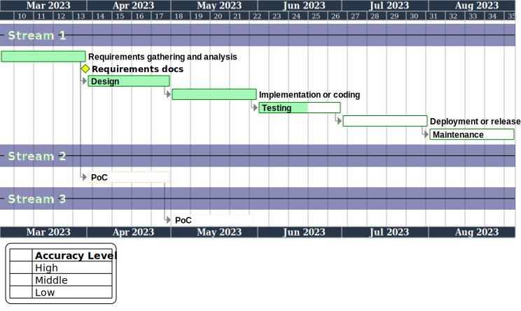

# plantUML gantt

This repo is template.  



## [main.pu](./components/main.pu)

You can configure gantt-chart to include the following:

* Tasks
* Milestones
* Dependencies

## [style.pu](style.pu)

You can configure the drawing format to include the following:

* Font
* Line style
* Language
* Any size
* Any color

### color config

The method for defining transparency in PlantUML color codes can vary depending on the environment.

For example, to set the transparency of a color to 50%, you can use either:

*adding two digits to the top of the color code*

```less
80191970
```

or  
*adding two digits to the lower of the color code*

```less
19197080
```


## [function.pu](function.pu)

Functions to expand.
### the same task name appear multiple times

```less
N("task name", task_id)
```

## [vars.pu](vars.pu)

You can configure color of accuracy levels. 
